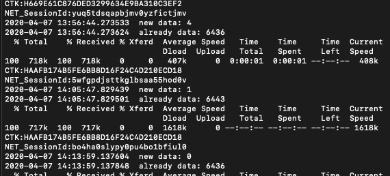
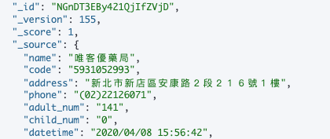
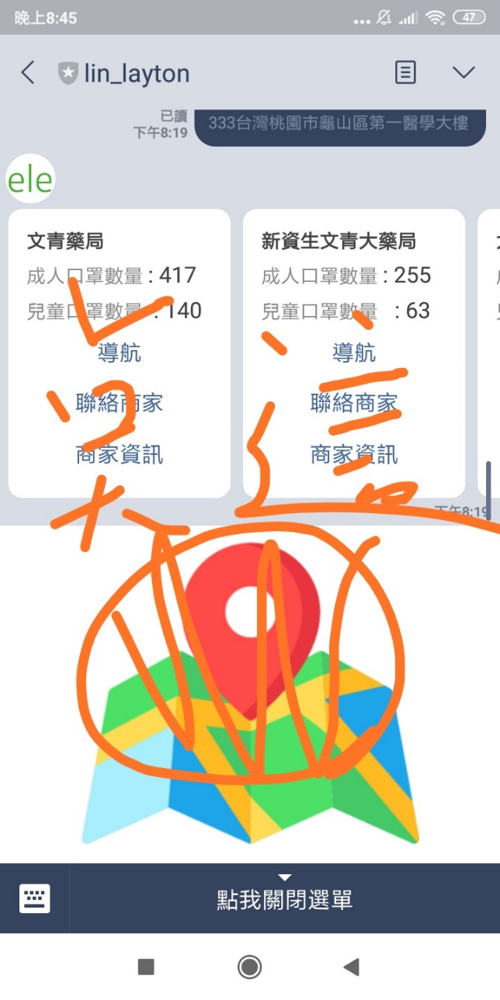
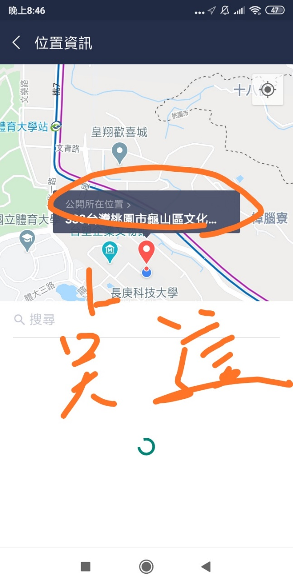
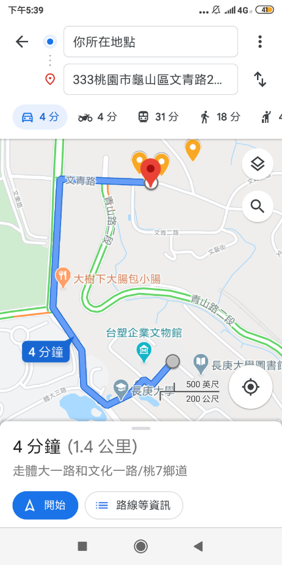

  - # 正確顯示10家附近的藥局名稱、地址、二種口罩數量:

測試二個同一地點、不同時間（間隔4hr以上）之口罩數量，截下機器人回傳的畫面

  - 下午五點多

下午十點多

  - # 口罩數量能隨時間更新：20%

模擬ＴＧＯＳ封包，一個session限制500左右，自動取得session．而查詢也要時間．所以先查詢資料庫，這藥局代碼在不在，不再才需要查詢，整體更新過程大概20秒．

程式碼執行過程:

可以從資料庫 \_VERSION看出更新次數:

  - # 美化、強化功能(需在word/PDF檔內說明)：

使用圖文選單 創建簡單的打開分享位置的line功能

https://line.me/R/nv/location/

Opens the "Location" screen. Users can share the current location or
drop a pin on the map to select the location they want to share.

回傳的flex messages有google map url
API導航跟查詢，和撥打藥局電話的功能

[https://developers.google.com/maps/documentation/urls/guide?hl=zh-tw](https://developers.google.com/maps/documentation/urls/guide?hl=zh-tw)

default(self)

Set the default handler method by using this decorator.

@handler.default()

def default(event):

print(event)

If there is no handler for an event, this default handler method is
called.

當使用者不使用分享位置功能，回傳如何使用此機器人

Line\_bot\_id: @782hqsjh
