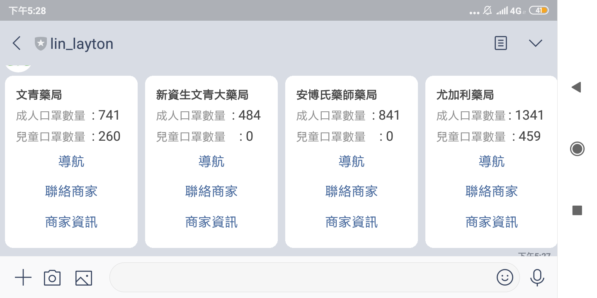
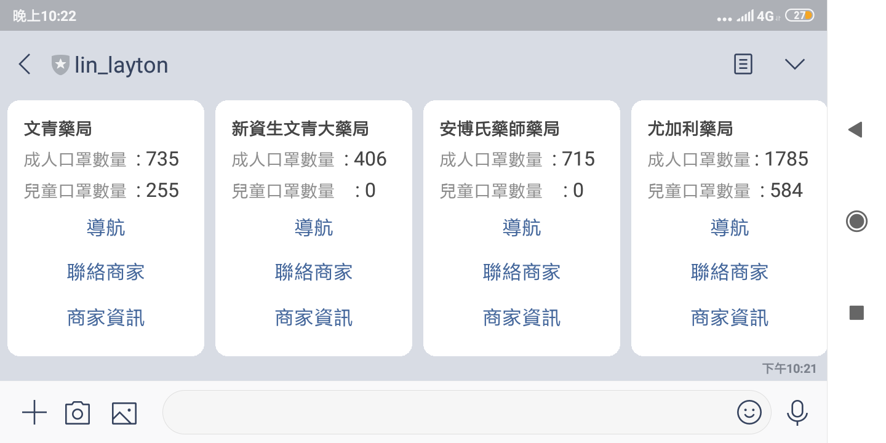

-   正確顯示10家附近的藥局名稱、地址、二種口罩數量:
    ===============================================

測試二個同一地點、不同時間（間隔4hr以上）之口罩數量，截下機器人回傳的畫面

-   下午五點多

{width="5.0625in"
height="2.53125in"}{width="5.0625in"
height="2.53125in"}{width="5.0625in"
height="2.53125in"}

{width="5.013888888888889in"
height="2.5069444444444446in"}下午十點多{width="5.333333333333333in"
height="2.6666666666666665in"}{width="6.5in"
height="3.25in"}

-   口罩數量能隨時間更新：20%
    =========================

模擬ＴＧＯＳ封包，一個session限制500左右，自動取得session．而查詢也要時間．所以先查詢資料庫，這藥局代碼在不在，不再才需要查詢，整體更新過程大概20秒．

程式碼執行過程:

{width="6.555555555555555in"
height="2.967251749781277in"}

可以從資料庫 \_VERSION看出更新次數:

{width="4.375in"
height="1.84375in"}

-   美化、強化功能(需在word/PDF檔內說明)：
    ======================================

使用圖文選單 創建簡單的打開分享位置的line功能

{width="2.923611111111111in"
height="5.847222222222222in"}

https://line.me/R/nv/location/

Opens the \"Location\" screen. Users can share the current location or
drop a pin on the map to select the location they want to share.

{width="2.9444444444444446in"
height="5.888888888888889in"}

回傳的flex messages有google map url API導航跟查詢，和撥打藥局電話的功能

[[https://developers.google.com/maps/documentation/urls/guide?hl=zh-tw]{.underline}](https://developers.google.com/maps/documentation/urls/guide?hl=zh-tw)

{width="2.1006944444444446in"
height="4.201388888888889in"}{width="2.076388888888889in"
height="4.152777777777778in"}{width="2.0729166666666665in"
height="4.145833333333333in"}

default(self)

Set the default handler method by using this decorator.

\@handler.default()

def default(event):

print(event)

If there is no handler for an event, this default handler method is
called.

當使用者不使用分享位置功能，回傳如何使用此機器人

{width="3.6145833333333335in"
height="7.229166666666667in"}

Line\_bot\_id: \@782hqsjh
